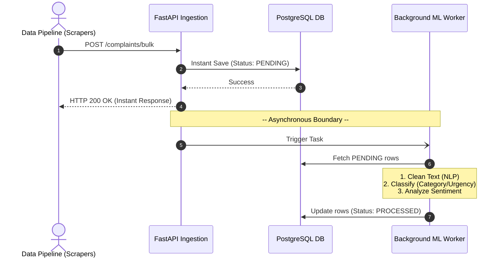

# Smart Urban Grievance & Infrastructure Monitoring System


## 📖 Abstract

Rapid urbanization and increasing population density have created major challenges in urban infrastructure management, including traffic congestion, flooding, water scarcity, power outages, and public grievance handling. Traditional grievance redressal systems are mostly reactive, manual, and inefficient. 

This project proposes a **Proactive, Data-Driven Urban Intelligence Platform** using Web Data Mining techniques. The system collects and analyzes data from multiple sources (social media platforms, news websites, open government datasets) to identify, classify, and prioritize civic issues in real time.

By leveraging advanced **Natural Language Processing (NLP)** and **Machine Learning** algorithms, we aim to transform traditional complaint-based governance into a smart monitoring system that improves response efficiency, resource allocation, and public trust.

---

## ✨ Key Features & Capabilities

- **Real-Time Data Ingestion:** Automated data pipelines ingesting batch payloads of unstructured grievances from social media and web platforms.
- **NLP Preprocessing Pipeline:** Intelligent text cleaning and normalization to handle noisy social media data.
- **Sentiment & Urgency Classification:** Utilizing Naive Bayes and machine learning classifiers to determine the severity of a complaint (e.g., immediate infrastructural hazard vs. general feedback).
- **Advanced Data Mining:**
  - *TF-IDF Information Retrieval*: Extracting key infrastructural entities.
  - *Association Rule Mining*: Detecting hidden relationships between different municipal issues.
  - *PageRank-based Credibility Analysis*: Filtering misinformation and spam.
  - *Sequential Pattern Mining*: Predicting cascading infrastructure failures.
- **Interactive Analytics Dashboard:** Heatmaps, alerts, and trend analysis endpoints designed to be consumed by municipal authorities.

---

## 🏗️ Technical Architecture

This project strictly adheres to a **Layered Architecture** pattern, ensuring separation of concerns, high maintainability, and testability.

```
src/
├── api/            # Controllers handling HTTP routing and request validation
├── services/       # Business logic orchestration and NLP integration
├── repositories/   # Database access layer (SQLAlchemy)
├── entities/       # Database models representing relational tables
├── dto/            # Data Transfer Objects (Pydantic) for I/O validation
├── nlp/            # NLP cleaning, classification, and scoring models
└── patterns/       # Advanced mining algorithms (TF-IDF, PageRank, etc.)
```

### Tech Stack
- **Backend Framework:** FastAPI (Asynchronous, High Performance)
- **Database:** PostgreSQL (Relational Data Storage)
- **ORM:** SQLAlchemy (with Database Migrations)
- **Data Validation:** Pydantic
- **Data Mining & NLP:** Custom Python Pipelines (Integration with scikit-learn/NLTK planned)

---

## 🚀 Upcoming Roadmap (What We Are Doing Next)

As we evolve from manual entry to full automation, our immediate engineering goals are:

1. **[COMPLETED] Batch Ingestion Pipeline:** Implement `/complaints/bulk` endpoints with bulk SQLAlchemy insertions.
2. **[COMPLETED] Asynchronous Processing:** Offload the heavy NLP and Data Mining tasks to FastAPI `BackgroundTasks`.
3. **[COMPLETED] Classification Intelligence:** Integrate Naive Bayes classification mock for automated Category, Urgency, and Sentiment tagging.
4. **[PLANNED] Predictive Analytics Integration:** Connect the sequential pattern mining algorithms.
5. **[PLANNED] Advanced Filtering & Geolocation:** Enhance our geospatial queries using PostGIS.

---

## 🧠 Machine Learning Pipeline (Under the Hood)

To ensure this system is "Intelligent", we follow a rigorous Machine Learning training and prediction lifecycle for our classifiers (like Naive Bayes). Here is a step-by-step breakdown of how the ML model is trained and how it predicts accuracy:

### Phase 1: Data Collection & Preprocessing
- **Step 1:** Collect historical data (e.g., thousands of past civic complaints).
- **Step 2:** Human experts manually label this data (e.g., tagging a tweet as `Category: Water`, `Urgency: HIGH`).
- **Step 3 (NLP):** We pass this text through our NLP pipeline to lowercase it, remove punctuation, and remove "stopwords" (common words like *is, the, and* that hold no analytical value).

### Phase 2: Feature Extraction (TF-IDF)
Machine learning models cannot read English text; they only understand numbers.
- **Step 4:** We use **TF-IDF (Term Frequency - Inverse Document Frequency)** to convert the cleaned text into a massive matrix of numbers. It gives a high mathematical weight to rare, important words (like "pothole" or "pipe") and low weight to common words.

### Phase 3: Model Training
- **Step 5 (Splitting):** We split our dataset. 80% is used for training, and 20% is hidden away for testing.
- **Step 6 (Training):** We feed the 80% TF-IDF data into our **Multinomial Naive Bayes** algorithm. The model learns probabilities (e.g., "If I see the word 'pothole', there is a 95% probability the category is 'Roads'").

### Phase 4: Predicting Accuracy & Evaluation
- **Step 7 (Testing):** We take the hidden 20% of data (which the model has never seen) and ask the model to predict the categories.
- **Step 8 (Accuracy Scoring):** Since we already know the true human labels for the 20% testing data, we compare them against the model's predictions. If the model predicted 900 out of 1000 correctly, our system achieves **90% Accuracy**. We also look at a **Confusion Matrix** to see if it accidentally confuses "Water" issues with "Electricity" issues.

---

## 📊 System Architecture Visualization

Here is exactly how data flows through our current implementation:



---

## 💻 Getting Started (Development)

### Prerequisites
- Python 3.9+
- PostgreSQL Server running locally or via Docker

### Installation

1. **Clone the repository:**
   ```bash
   git clone https://github.com/your-username/smart-urban-grievance.git
   cd smart-urban-grievance
   ```

2. **Install dependencies:**
   ```bash
   pip install -r requirements.txt
   ```

3. **Configure the Database:**
   Ensure PostgreSQL is running and update your database URL in the configuration files (or `database/database.py`).

4. **Run the FastAPI Server:**
   ```bash
   uvicorn src.main:app --reload
   ```
   The API will be accessible at `http://127.0.0.1:8000`. You can view the automated interactive API documentation at `http://127.0.0.1:8000/docs`.
