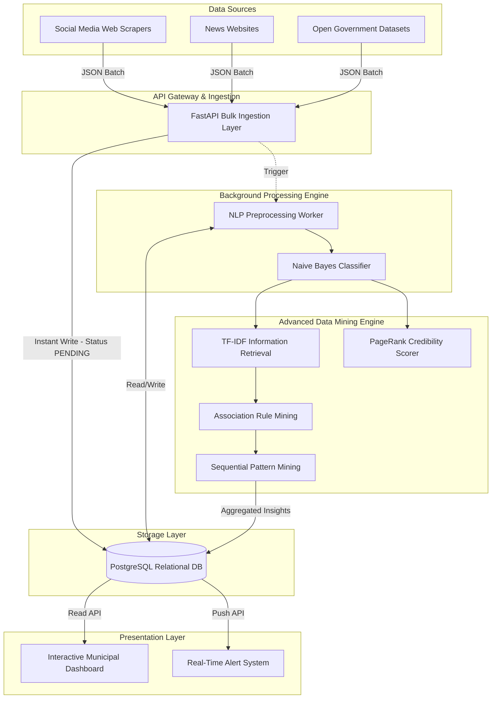

# System Design: Smart Urban Grievance & Infrastructure Monitoring System

This document outlines the formal System Design (both High-Level and Low-Level) for the project.

---

## 1. High-Level Architecture (HLD)

The system follows a modern, event-driven, microservices-inspired architecture designed for high scalability and real-time processing.

---

## 2. Component Design & Responsibilities (LLD)

### A. Data Ingestion Layer (FastAPI)
- **Responsibility:** Act as the entry point for all scraped data. Must handle high throughput without crashing.
- **Design Choice:** Uses asynchronous non-blocking I/O (`FastAPI`). Instead of processing data synchronously, it instantly saves raw data to PostgreSQL and delegates heavy lifting to a Background Task Queue.

### B. NLP Preprocessing Engine
- **Responsibility:** Normalize noisy, unstructured web text.
- **Pipeline:** 
  1. Tokenization & Lowercasing.
  2. Noise removal (special characters, URLs).
  3. Stop-word removal to reduce vector space dimensionality.

### C. Classification Engine (Machine Learning)
- **Responsibility:** Categorize the normalized text.
- **Algorithm:** **Naive Bayes Classifier**.
- **Why Naive Bayes?:** It is highly efficient for text categorization (e.g., classifying a complaint into "Water", "Electricity", or "Roads") because it calculates the probability of a category based on the presence of specific keywords independently.

### D. Advanced Data Mining Engine
This is the core "brain" of the project, executing specific algorithms to extract urban intelligence:

#### 1. Information Retrieval (TF-IDF)
- **Purpose:** Identifies the most mathematically "important" words in a grievance. 
- **Application:** If a thousand tweets mention "pothole", but only 50 mention "Main Street Sinkhole", TF-IDF ensures "Sinkhole" is weighted heavier as a unique, critical entity rather than common noise.

#### 2. Credibility Analysis (PageRank)
- **Purpose:** Filter out spam, bots, and misinformation.
- **Application:** Borrowing from Google's algorithm, users (nodes) who frequently post corroborated, accurate complaints gain a higher "trust rank". Complaints from high-rank nodes are prioritized for municipal alerts.

#### 3. Hidden Relationship Detection (Association Rule Mining)
- **Purpose:** Finding non-obvious correlations.
- **Application:** Discovering that `[Heavy Rain]` + `[Sector 4]` frequently leads to `[Power Outage]`. This allows authorities to pre-emptively dispatch electrical crews when rain is forecasted in Sector 4.

#### 4. Predictive Analytics (Sequential Pattern Mining)
- **Purpose:** Predicting cascading infrastructure failures over time.
- **Application:** Identifying patterns such as: `Water Pipe Burst (Day 1) -> Road Subsidence (Day 3) -> Traffic Gridlock (Day 4)`. By identifying Day 1, the system predicts Day 4 and alerts traffic authorities proactively.

---

## 3. Data Flow & Request Lifecycle

1. **Ingestion:** Scraper sends `[N]` JSON objects to `/complaints/bulk`.
2. **Fast Save:** System validates schema (DTO) and writes to DB with `status="PENDING"`. Network connection is closed; client is freed.
3. **Queue:** Event loop triggers Background Task.
4. **NLP & Classify:** Background task cleans text, runs Naive Bayes, and tags the entity (Category, Urgency, Sentiment). Updates DB to `status="PROCESSED"`.
5. **Batch Mining:** A scheduled Cron Job (e.g., every 1 hour) runs TF-IDF and Association Rule Mining on all newly `PROCESSED` rows to generate updated heatmaps and detect new sequential patterns.
6. **Visualization:** Dashboard queries the aggregated pattern tables to render heatmaps for municipal authorities.

---

## 4. Scalability Reasoning (Interview Talking Points)

- **Why a Layered Architecture?** By separating API Controllers from Business Logic (Services) and Database operations (Repositories), the system is loosely coupled. We can swap PostgreSQL for MongoDB later without touching the NLP code.
- **Why Background Tasks over Synchronous APIs?** Synchronous NLP processing would block the web server, limiting us to a few requests per second. Background processing allows us to scale ingestion infinitely while processing text at a safe, controlled rate.
- **Why Relational DB (PostgreSQL)?** Urban complaints are highly structured entities (Location, Timestamp, Category, User) that benefit from ACID compliance and complex SQL `JOIN` queries for dashboard analytics. PostGIS can be added later for advanced geospatial heatmaps.
